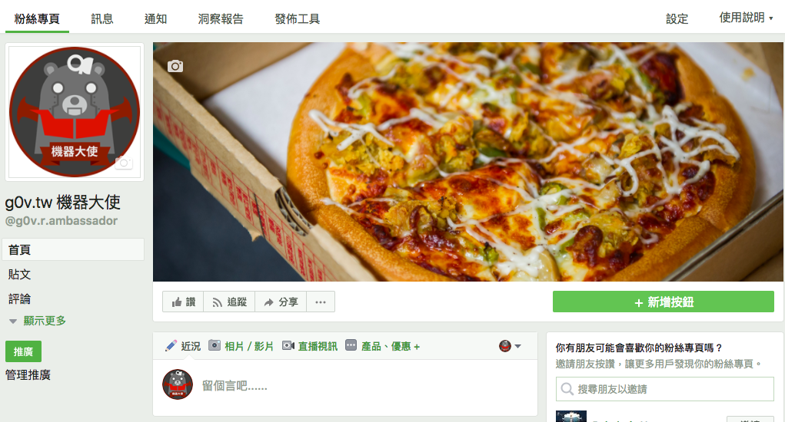

class: inverse, center, middle

## Yet Another g0v Hub
### caasih

2017.09.16

---

# 問題

---

# 問題

  * 新人不便入坑

---

# 問題

  * 新人不便入坑
  * 整理專案資料勞心勞力

---

class: center, middle

# dashboard prototype

---

# 其他形式

---

# 其他形式

  * GitHub app 是不是更合適？

---

# 其他形式

  * GitHub app 是不是更合適？
  * Web Annotation 是不是比自己寫來得快？

---

class: center, middle

# 粉絲專頁

---

class: center, middle

---

class: center, middle

# issue review

---

# 不足之處很多

  * 如何避免變成一人工具
    * 缺乏使用者訪談計畫
  * 如何評估專案的確有成效，而不是因其他理由入坑？
    * 新參者要不要註冊？
    * 新參者使用一段時間後，如何做調查？
  * 只有一個人做嗎？如何和其他人合作？
    * 後勤中心？
    * g0v.news ？
