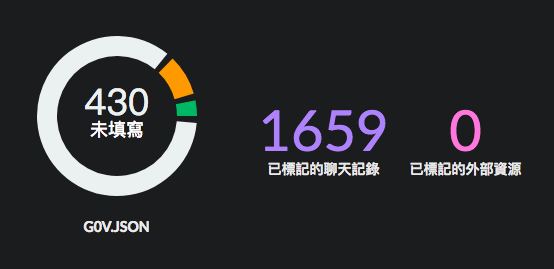

class: inverse, center, middle

## g0v 專案中心: Yet Another g0v Hub
### caasih

2018.03.17

---

# 初衷 

2013 和 2014 年的 g0v 專案給我很多回憶，但是這些專案不見得繼續維護，也看過很多專案開了坑卻無法繼續下去。我想整理這些專案，為他們多添加一些脈絡，也許會有更多人填坑。

我希望將整理資料的工具，視為整理資料的人的延伸。本來打算以貢獻者的社群動態為中心，將貢獻者在社群網站、 GitHub 、 Slack 的活動情況整理在獨立的儀表板上。也在線上訪問過專案。目前與揪松團討論後，修正了方向，以整理與呈現 g0v.json 記載的專案內容為主，標記外部資源為輔。

---

# 成果

---

---

---

---

# 未完的工作

* 未更新 g0v.json editor
* 沒能補上大半的 g0v.json
* 還沒接上 websocket ，看不到別人正在做什麼
* 未接上解決人坑技能問題的 g0ver
* 新揪松網未來將成為專案入口，登入和專案列表該以它為主

---

class: center, middle

# [https://amb.g0v.tw](https://amb.g0v.tw)
