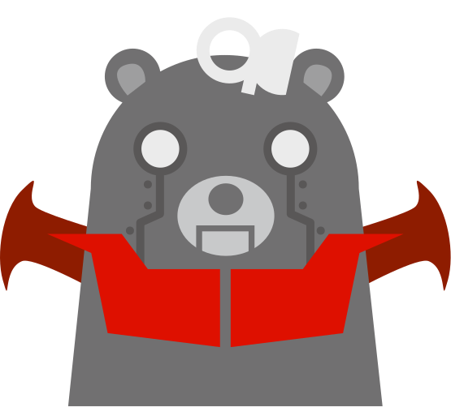
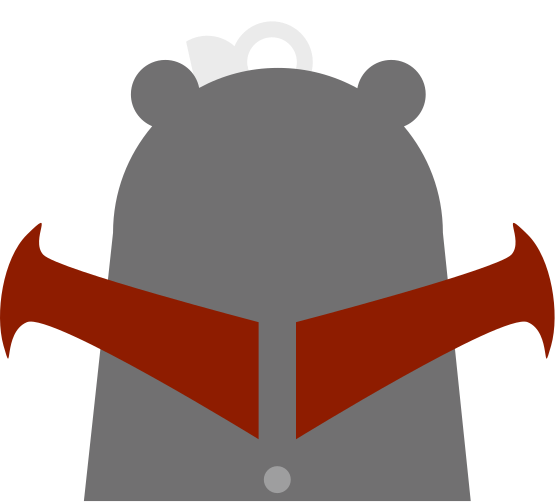

class: inverse, center, middle

## g0v 專案中心: Yet Another g0v Hub
### 卡西

2018.03.17

---

# 初衷 

2013 和 2014 年的 g0v 專案給我很多回憶，但是這些專案不見得繼續維護，也看過很多專案開了坑卻無法繼續下去。我想整理這些專案，為他們多添加一些脈絡，也許會有更多人填坑。

我希望將整理資料的工具，視為整理資料的人的延伸。本來打算以貢獻者的社群動態為中心，將貢獻者在社群網站、 GitHub 、 Slack 的活動情況整理在獨立的儀表板上。也在線上訪問過專案。

開發過程中得到揪松團的建議，考量個人能力有限，修正方向，以整理與呈現 g0v.json 記載的專案內容為主，標記外部資源為輔。

---

# g0v.json

---

# 升級

---

---

# 彙整

---

---

---

# 註記

---

---

# 統計

* g0v.json
  * 格式正確的有 16 筆
  * 格式待修正的有 42 筆
  * 待補的有 430 筆
* 已標記的聊天記錄有 1684 筆

---

class: center, middle

# [https://amb.g0v.tw](https://amb.g0v.tw)
